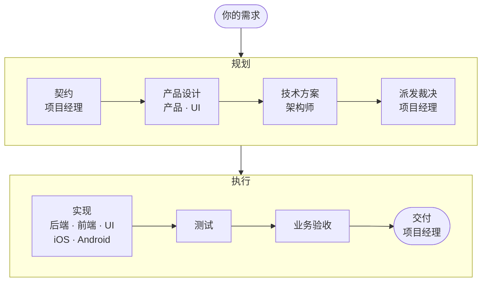
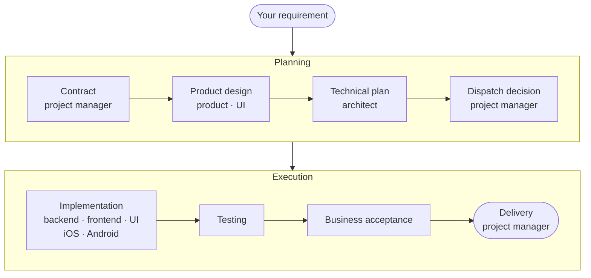

<div align="center">

# agent-team

**十角色软件开发 agent team —— 一个 Claude Code 插件**

项目经理就是你的主会话：分层派发任务，执行顺序由门禁强制，业务验收独立成线。

[](.claude-plugin/plugin.json) [](./LICENSE) 

**简体中文** · [English](#english)

</div>

**状态：** 十角色、阶段链 `S1`–`S8` 已在真实项目上完整跑通（`--plugin-dir` 加载方式下）；通过 GitHub 安装时的加载、命令与六道门禁也已逐项验证。

## 特性

- 🧭 **项目经理就是主会话**：你只跟项目经理对话。它把你的需求逐字冻结成契约，再分层派给产品、架构、实现、测试与验收各角色。
- 🚦 **顺序由门禁强制**：六道 hook 门禁——派发白名单、前置就绪、写路径隔离、契约保护、交付物核验、返工预算——拦下越级派发与越界写入。
- ✅ **业务验收独立成线**：测试之外，还有一道对着你的原话逐条核对的业务验收。
- 👀 **过程看得见**：在桌面应用里，每个角色的完整过程都能单独查看；同一阶段的角色并行干活。
- 📦 **零 npm 依赖**：纯插件，只要 PATH 上有 Node；不起服务、不监听端口。

## 安装

在要让团队干活的**项目目录**下执行：

```sh
claude plugin marketplace add hangwenlei/agent-team --scope local
claude plugin install agent-team@agent-team-marketplace --scope local
```

装好后在这个目录里新开一个会话，主会话就是项目经理。插件只对这一个项目生效，不影响别的项目。

**前提**：

- **Node 16.9 或更新**，而且要在 Claude Code 启动时的 PATH 上——门禁就是用它跑的。原生安装的 Claude Code 自己不需要 Node，所以要单独确认。桌面端和 IDE 起的会话用的是它们自己的环境，不一定和你终端里的一致；装完或换了 Node，要重开 Claude Code（桌面端要完全退出再打开）。
- **Claude Code 2.1.276 或更新**。桌面端保持应用为最新即可。

Node 找不到、旧到门禁起不来，或者 hooks 被关掉时，平台不拦任何调用，门禁一道都不生效，界面上至多一行不起眼的灰字。所以项目经理在 `/agent-team:at`、`/agent-team:at-resume`、`/agent-team:at-init` 开头，以及之后你每发一条消息、它这一轮第一次派发或写 `.agent-team` 之前（续会话之后也一样），都会做一次**门禁自检**：故意写一个门禁一定会拦下的文件。每次自检都会在界面上留下一条被拦下的写入（显示为一条错误），内容以「门禁自检：在线」开头——那就是自检，属预期。门禁没拦下它，项目经理会停下来，告诉你怎么查。`/agent-team:at-status` 只读，不做这项检查。

Node 起得来但太旧时，门禁会拒绝每一次派发与写入，并写明要装哪个版本。自检不核 Claude Code 的版本：版本不够时，门禁可能照常在跑、自检也通过，分层派发却走不通——所以要自己确认，终端里用 `claude --version`，桌面端保持应用为最新。

**更新**——版本号变了才会拉到新版，已经开着的会话要重开才生效：

```sh
claude plugin update agent-team@agent-team-marketplace --scope local
```

**卸载**：

```sh
claude plugin uninstall agent-team@agent-team-marketplace --scope local
```

卸载不会移除市场，也不会删掉 `~/.claude/plugins/cache/` 下的插件副本。要彻底清理，再执行 `claude plugin marketplace remove agent-team-marketplace --scope local`，并手动删掉那份缓存。

<details>
<summary>不安装，直接从本地克隆加载（开发用）</summary>

```sh
claude --plugin-dir /path/to/agent-team
```

用这种方式时，每次续会话都要带上这个参数，见[已知边界](#已知边界)。

</details>

## 使用

### 命令

| 命令 | 作用 |
|---|---|
| `/agent-team:at-init` | **先跑它，每个项目一次。** 勘察项目，写出 `.agent-team/project.json` |
| `/agent-team:at <需求>` | **起一趟 run。** 原话逐字写进契约，从 `S1` 一路带到 `S8` |
| `/agent-team:at-status` | **看进度。** 只读：当前阶段、产物、返工与待你回答的问题 |
| `/agent-team:at-resume` | **接着跑。** 上下文压缩后或换了会话时，从磁盘恢复这一趟 |

### 一趟 run 怎么走

<!-- 阶段与角色的真源是 stages.json；这张图的箭头数由 tests/readme-sync.test.mjs 钉成与阶段数相等 -->


实现阶段的角色由架构师分发，项目经理不越级派发；同一阶段的角色并行干活。谁能派谁以 `roster.json` 为准，每一段谁来做、交什么以 `stages.json` 为准。

交付之后这一趟就收口了：不再回退，也不再派人。接着要改动或修复，用 `/agent-team:at <改动>` 另起一趟（新的契约、新的返工预算）。返工时，测试、验收与交付报告一律重新出，不沿用上一轮的。

### 什么时候会问你

项目经理是唯一会跟你说话的角色，只在下面五类事上停下来问你：

| 类别 | 情形 |
|---|---|
| 敏感操作 | 凭据密钥、花钱、对外发布、删改非本趟产出的文件、`git push`、改 CI/CD 或生产配置 |
| 契约冲突 | 某个角色的产出违背契约，或契约里的两条没法同时满足 |
| 需要取舍 | 两个方案都满足契约但不能兼得，而且差别你感受得到 |
| 需求缺口 | 需求自相矛盾或缺关键信息，怎么猜都可能白做 |
| 返工用尽 | 返工次数用完了还不通过 |

每次提问都会引用契约原文，给出 2–4 个具体选项、各自的后果和它的推荐；你的回答会作为修订写进契约。技术选型、裁掉哪些角色、代码风格这类事，它自己决定。

另外，上一趟还没走完你又起了一趟新的，它会先问你接着跑哪一趟。

返工用尽时，只有选项「再返工一轮：回到 <段>」会被门禁记成再来一轮的批准；在对话里单独发一条只写这一句的消息也算——会话问不了你时（后台会话、不带权限提示的 `-p`），这是唯一的路。

### 产物在哪

```text
.agent-team/
├── project.json        勘察结果：各角色能写的目录、可用角色、构建与测试命令
├── reach.json          算上派发之后，各角色实际能写到的地方
├── current-run         当前这一趟的 run id
└── runs/<run_id>/
    ├── 00-contract.md  契约：你的原话与修订记录
    ├── …               各阶段的产物（实现阶段每个执行角色各一份）
    ├── approvals.jsonl 你批准过的额外返工轮（门禁自己记）
    ├── delivered.json  门禁记下的已交付产物快照
    └── state.json      这一趟的账本
```

代码本身写进 `project.json` 分给各角色的目录里。

## 怎么看每个角色

在桌面应用里，项目经理就是你正在看的这个会话，其余角色是它派出去的子代理。每次派发在对话里收成一行灰色小字（如「Ran an agent, finished 6 background tasks」）：

1. **点那一行**，右侧打开 Background tasks 面板：每个角色一条（包括架构师再派出去的下级），显示状态、用时、用量与工具调用次数。
2. **点某一条的 View transcript**，查看这个角色的完整过程：拿到的任务、读了哪些文件、改了什么、跑了什么命令、交回的报告。

角色只能看、不能直接对话，有问题会报给项目经理，由它来问你；整趟 run 始终是一个会话。项目经理用你在应用里选的模型，其余角色用 `sonnet`；命令行里项目经理默认也是 `sonnet`（见 `agents/at-pm.md`），可以用 `--model` 覆盖。

## 已知边界

> [!WARNING]
> **这不是沙箱。** 写路径隔离按 `project.json` 的 `paths` 管项目经理以外的各个角色：在 run 目录之外，只能写划给自己的前缀，没有条目就哪都写不了；例外是 `at-qa` 与 `at-acceptance`——它们按设计不认领目录，这道检查对它们在 run 目录之外整段放行。`Bash` 没有任何门禁看着，而执行角色保留它来构建和测试。项目经理在实现之前（实现中有角色被拒时也会）照架构方案往 `paths` 里补前缀（只加不删，补了什么会告诉你），这些前缀留给以后各趟。

> [!WARNING]
> **主会话会被接管成 `at-pm`。** 它的工具面是 `Agent(...)`（受派发白名单约束）、`AskUserQuestion`、`Bash`、`Read`、`Glob`、`Grep`、`Write`、`Edit`——能改动的范围与普通会话相当，把它限制在目标项目里的是角色说明，不是工具权限。它拿不到你在普通会话里能用的 MCP 工具与网页搜索、抓取（WebSearch、WebFetch）；其余角色各自只拿自己清单里的工具。按上面的方式安装，影响范围只在安装它的那个项目目录；也不要用 `--agent`、或在你自己的设置里设 `agent` 键，把主会话换成别的角色，门禁按主会话的身份判定。

> [!IMPORTANT]
> **续会话要带上 `--plugin-dir`。** `claude --resume` 不会继承这个参数；忘了带，CLI 会打印 `Continuing with the default tools and system prompt — the agent's tool restrictions no longer apply.`，插件命令与全部角色限制随即失效。按 local 作用域安装时同理：只在安装它的项目目录里续会话。

> [!CAUTION]
> **不要用 `claude plugin disable` 或 `claude plugin enable` 开关插件。** 一个会话的工具面在它的生命周期内是固定的，disable 不会把它还回来；enable 会接管已经在跑的会话。用完就结束会话，不再需要就卸载。

> [!NOTE]
> 在用着这支团队的项目里，门禁会拒绝它认不出指向哪个文件的写法：网络路径（项目不在同一个共享上时）、带流后缀或以点、空格结尾的 Windows 路径、不带盘符的设备路径；项目放在网络共享上时，写本地盘路径同样被拒。需要写这些位置时由你自己来写。

> [!NOTE]
> 项目经理自己发起的调用上，门禁判不出这次该怎么判时（比如运行状态读不出来、阶段记录不在阶段链里），会告诉项目经理怎么修，并在界面上给你一行提示。没有进行中的 run 时，项目经理派团队角色，界面上也会有一行提示，说明这次派发不受门禁约束。
>
> 正常放行默认不留记录。要让每次门禁调用都在会话转录里留一行，起会话时加 `--settings '{"env":{"AGENT_TEAM_GATE_TRACE":"1"}}'`。

## 开发

```sh
node --test
```

- 从仓库根目录直接跑 `node --test`，不要带路径参数——带了会漏掉测试，并报一个假的失败。
- **推 `main` 就是发布。** 每次推送都要挪 `.claude-plugin/plugin.json` 里的 `version`：`claude plugin update` 只比这个字符串。只改文档或测试挪最后一位，改到插件会加载的文件挪中间一位；任何一位不长到 10，满了进到上一位（1.9.0 之后是 2.0.0）。
- CI 在 Linux、macOS、Windows 上跑全部测试；推 `main` 或向 `main` 提 PR 时还会核版本号是否按上一条挪了。先推功能分支、等 CI 全绿，再合进 `main` 推送。
- 跑测试要 Node 22 或更新——安装一节写的 Node 下限只管门禁。CI 另有一个作业把门禁换到那个最低版本上跑全部测试，所以 `hooks/` 下的代码不能用比它更新的 Node API。
- 设计记录与实测记录在 `docs/` 下。

## 许可

MIT — 见 [LICENSE](./LICENSE)。

---

<a id="english"></a>

<div align="center">

# agent-team

**A ten-role software development agent team — as a Claude Code plugin**

The project manager is your main session: it dispatches work through a layered hierarchy, gates enforce the order, and business acceptance runs as its own track.

[简体中文](#agent-team) · **English**

</div>

**Status:** ten roles on an `S1`–`S8` stage chain, run end to end on a real project (loaded with `--plugin-dir`); loading, commands and all six gates are also verified for the GitHub install.

## Features

- 🧭 **The project manager is your main session.** You only talk to the project manager. It freezes your requirement word for word as the contract, then dispatches product, architecture, implementation, testing and acceptance roles layer by layer.
- 🚦 **Gates enforce the order.** Six hook gates — dispatch whitelist, readiness, write-path isolation, contract protection, deliverable checks and rework budget — stop out-of-order dispatch and out-of-bounds writes.
- ✅ **Business acceptance is its own track.** Beyond testing, a separate acceptance pass checks the result against your original words, clause by clause.
- 👀 **You can watch every role.** In the desktop app each role's full run can be viewed on its own, and roles in the same stage work in parallel.
- 📦 **No npm dependencies.** A pure plugin that only needs Node on the PATH: no services, no open ports.

## Installation

Run these in the **project directory** you want the team to work in:

```sh
claude plugin marketplace add hangwenlei/agent-team --scope local
claude plugin install agent-team@agent-team-marketplace --scope local
```

Then start a new session in that directory — the main session is the project manager. The plugin applies to this one project only.

**Requirements:**

- **Node 16.9 or later** on the PATH that Claude Code starts with — the gates run on it. A native install of Claude Code does not need Node itself, so check it separately. Sessions started from the desktop app or an IDE use that app's environment, which may differ from your terminal's; after installing or switching Node, restart Claude Code (quit the desktop app completely and reopen it).
- **Claude Code 2.1.276 or later.** For the desktop app, keeping the app up to date is enough.

If Node is missing or too old for the gates to start, or hooks are disabled, the platform blocks nothing: no gate takes effect, and at most one easy-to-miss grey line appears. That is why the project manager runs a **gate self-check** at the start of `/agent-team:at`, `/agent-team:at-resume` and `/agent-team:at-init`, and again after each message you send, before its first dispatch or first write under `.agent-team` in that turn (including after a session is resumed): it deliberately writes a file the gates always block. Each self-check shows up as a blocked write (shown as an error) whose text starts with the self-check's “online” message — that is expected. If the gates fail to block it, the project manager stops and tells you what to check. `/agent-team:at-status` is read-only and skips this check.

If Node starts but is too old, the gates refuse every dispatch and write and say which version to install. The self-check does not check the Claude Code version: on an older Claude Code the gates may run and the self-check pass while layered dispatch still fails — so check it yourself with `claude --version` in a terminal, and keep the desktop app up to date.

**Update** — a new release arrives only when its version number changes, and sessions already open need a restart:

```sh
claude plugin update agent-team@agent-team-marketplace --scope local
```

**Uninstall**:

```sh
claude plugin uninstall agent-team@agent-team-marketplace --scope local
```

Uninstalling neither removes the marketplace nor deletes the plugin copy under `~/.claude/plugins/cache/`. For a full cleanup, also run `claude plugin marketplace remove agent-team-marketplace --scope local` and delete that cache by hand.

<details>
<summary>Load from a local clone without installing (for development)</summary>

```sh
claude --plugin-dir /path/to/agent-team
```

Loaded this way, pass the flag again every time you resume a session — see [Known Limitations](#known-limitations).

</details>

## Usage

### Commands

| Command | What it does |
|---|---|
| `/agent-team:at-init` | **First, once per project.** Writes `.agent-team/project.json` |
| `/agent-team:at <requirement>` | **Start a run.** Your words become the contract; it runs `S1` to `S8` |
| `/agent-team:at-status` | **Check progress.** Stage, deliverables, rework, open questions |
| `/agent-team:at-resume` | **Resume a run.** After compaction or in a new session |

### How a run flows

<!-- stages.json is the source of truth for stages and roles; tests/readme-sync.test.mjs pins this diagram's arrow count to the number of stages -->


Implementation roles are dispatched by the architect — the project manager does not skip levels — and roles in the same stage work in parallel. Who may dispatch whom is defined in `roster.json`; which role does each stage and what it hands over, in `stages.json`.

Once delivered, the run is closed: no more rollbacks and no more dispatches. For further changes or fixes, start a new run with `/agent-team:at <change>` (a new contract and a fresh rework budget). During rework, the test, acceptance and delivery reports are always produced anew rather than carried over from the previous round.

### When it asks you

The project manager is the only role that talks to you, and it stops to ask about five kinds of things only:

| Kind | When |
|---|---|
| Sensitive | Secrets, spending, publishing, deleting others' files, `git push`, CI/CD or prod config |
| Conflict | A role's output violates the contract, or two of its clauses cannot both be met |
| Trade-off | Two options both meet the contract, can't both be had, and differ in ways you'd notice |
| Gap | The requirement contradicts itself or lacks key facts; any guess may waste the work |
| Rework | Rework still fails after its budget is used up |

Each question quotes the contract and offers two to four concrete options with their consequences and a recommendation; your answer is added to the contract as a revision. Technology choices, which roles to leave out and code style are decided without asking you.

Also, if you start a new run while the previous one is unfinished, it first asks which one to continue.

When rework runs out, only the option 「再返工一轮：回到 <stage>」 is recorded by the gates as approval for another round; a message containing just that line counts too — in a session that cannot ask you (a background session, `-p` without a permission prompt), it is the only way.

### Where things land

```text
.agent-team/
├── project.json        the survey: writable directories per role, available roles, build and test commands
├── reach.json          where each role can actually write once dispatch is taken into account
├── current-run         the id of the current run
└── runs/<run_id>/
    ├── 00-contract.md  the contract: your words and its revisions
    ├── …               each stage's deliverables (one per implementation role in the implementation stage)
    ├── approvals.jsonl extra rework rounds you approved (recorded by the gates)
    ├── delivered.json  the gates' snapshot of delivered artifacts
    └── state.json      the run's ledger
```

The code itself goes into the directories `project.json` assigns to each role.

## Watching each role

In the desktop app the project manager is the session you are looking at; every other role is a subagent it dispatches. Each dispatch collapses into one grey line in the conversation (such as "Ran an agent, finished 6 background tasks"):

1. **Click that line** to open the Background tasks panel: one entry per role (including roles the architect dispatches in turn), with status, time, usage and tool-call count.
2. **Click View transcript** on an entry to see that role's full run: the task it was given, the files it read, what it changed, the commands it ran, and the report it handed back.

You can watch a role but not talk to it: roles report their questions to the project manager, which asks you, and a whole run stays one session. The project manager runs on the model you pick in the app and the other roles on `sonnet`; in the CLI the project manager also defaults to `sonnet` (see `agents/at-pm.md`), which `--model` overrides.

## Known Limitations

> [!WARNING]
> **This is not a sandbox.** Write-path isolation governs every team role except the project manager by the `paths` in `project.json`: outside the run directory a role may write only its own prefixes, and nothing at all without an entry; the exception is `at-qa` and `at-acceptance`, which claim no directories by design, so outside the run directory the check lets them through entirely. `Bash` is not watched by any gate, and implementation roles keep it to build and test. Before implementation (and during it, when a role is refused) the project manager adds prefixes to `paths` from the architecture plan (it only adds, and tells you what it added); they stay for later runs.

> [!WARNING]
> **The main session is taken over as `at-pm`.** Its tool surface is `Agent(...)` (bound by the dispatch whitelist), `AskUserQuestion`, `Bash`, `Read`, `Glob`, `Grep`, `Write` and `Edit` — it can change anything an ordinary session can, and what keeps it inside the target project is its role definition, not its permissions. It does not get the MCP tools or the web search and fetch tools (WebSearch, WebFetch) that an ordinary session has; every other role gets only the tools on its own list. Installed as above, its reach is limited to the one project directory that declares it. Don't swap the main session for another role with `--agent` or an `agent` key in your own settings either: the gates judge by the main session's identity.

> [!IMPORTANT]
> **Pass `--plugin-dir` every time you resume.** `claude --resume` does not inherit it; forget it and the CLI prints `Continuing with the default tools and system prompt — the agent's tool restrictions no longer apply.`, after which the plugin's commands and every role restriction are gone. With a local-scope install the same holds for directories: resume only in the project directory that holds the install.

> [!CAUTION]
> **Don't toggle the plugin with `claude plugin disable` or `claude plugin enable`.** A session's tool surface is fixed for its lifetime, and disabling does not hand it back; enabling takes over sessions that are already running. End the session when you are done, and uninstall when you no longer need it.

> [!NOTE]
> In a project that uses the team, the gates refuse writes whose target they cannot pin down: network paths (unless the project sits on that same share), Windows paths with a stream suffix or a segment ending in a dot or space, and device paths without a drive letter; with the project on a network share, local-drive paths are refused too. Write to such locations yourself.

> [!NOTE]
> On the project manager's own calls, when a gate cannot tell how to rule (for example, the run state cannot be read, or the recorded stage is not in the stage chain), it tells the project manager how to fix it and shows you a one-line notice. When no run is in progress, each time the project manager dispatches a team role you also see a one-line notice that the dispatch is not gated.
>
> An ordinary pass leaves no record by default. To log one line per gate invocation in the session transcript, start the session with `--settings '{"env":{"AGENT_TEAM_GATE_TRACE":"1"}}'`.

## Development

```sh
node --test
```

- Run bare `node --test` from the repository root, with no path argument — with one, tests are missed and a phantom failure is reported.
- **Pushing to `main` is the release.** Every push must bump `version` in `.claude-plugin/plugin.json`, because that string is all `claude plugin update` compares. Docs- or tests-only changes bump the last digit; changes to anything the plugin loads bump the middle one. No digit ever reaches 10: it carries into the one above (1.9.0 is followed by 2.0.0).
- CI runs the full test suite on Linux, macOS and Windows; pushes and pull requests to `main` also check that the version was bumped as described above. Push a feature branch and wait for CI to pass before merging into `main` and pushing.
- The test suite needs Node 22 or later — the Node minimum under Installation applies to the gates only. A separate CI job runs the whole suite with the gates on that minimum version, so code under `hooks/` must not use Node APIs newer than it.
- Design notes and measurement records live under `docs/`.

## License

MIT — see [LICENSE](./LICENSE).
